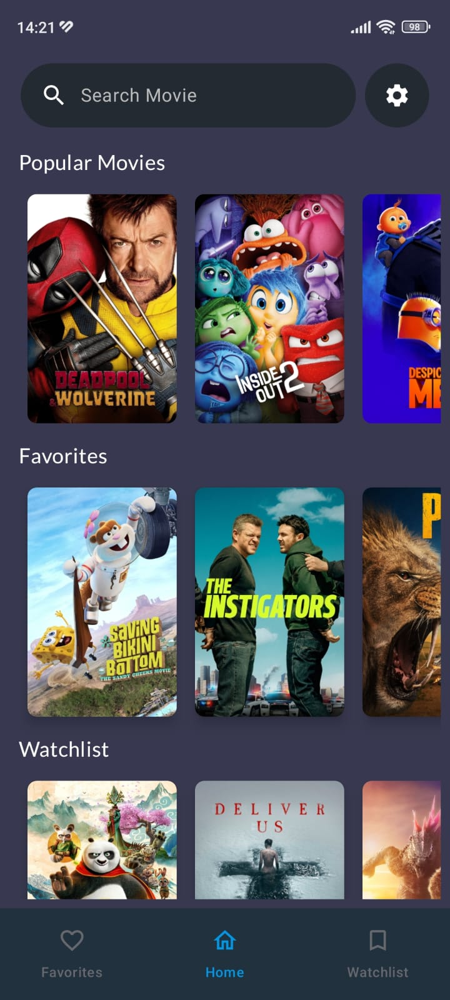
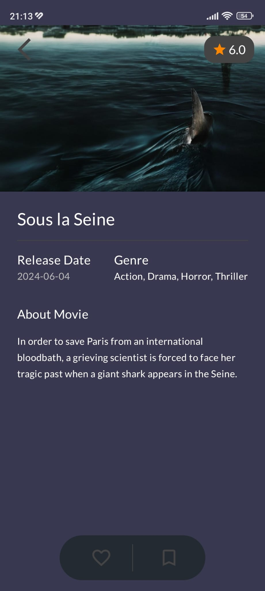
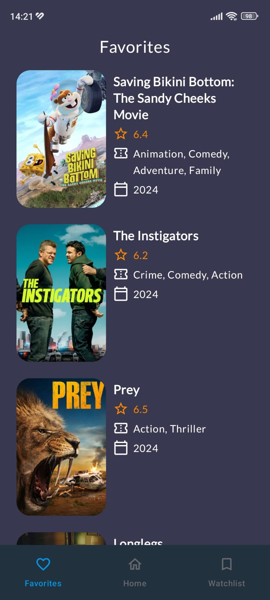
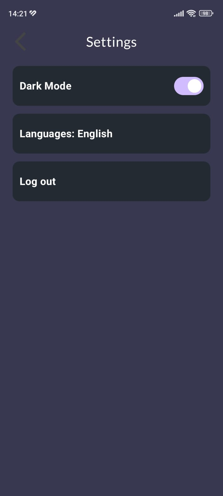

# 🎬 Movie Listing App

Welcome to the **Movie Listing App**! This Android application is built using modern Android development practices, including Jetpack Compose, MVVM architecture, Room, and Firebase Firestore. It allows users to search for movies, manage their favorite and watchlist, and explore popular movies using The Movie Database (TMDb) API.

## 📱 Features

- **Search Movies**: Search for movies using the TMDb API and view detailed information.
- **Favorites**: Add movies to your favorites list and store them locally using Room Database.
- **Watchlist**: Add movies to your watchlist and store them remotely using Firebase Firestore.
- **Popular Movies**: Explore popular movies fetched from TMDb API.
- **User Authentication**: Secure login and signup using Firebase Authentication.
- **Multi-Language Support**: Supports both English and Turkish languages.
- **Dark Mode/Light Mode**: Toggle between dark and light themes for a personalized experience.
- **Splash Screen**: Beautiful Lottie animation on the splash screen with automatic user authentication check.

## 🛠️ Tech Stack

- **Programming Language**: Kotlin
- **UI Framework**: Jetpack Compose
- **Architecture**: MVVM (Model-View-ViewModel)
- **Local Database**: Room Database
- **Remote Database**: Firebase Firestore
- **Authentication**: Firebase Authentication
- **API**: The Movie Database (TMDb) API
- **Dependency Injection**: Dagger/Hilt
- **Animation**: Lottie

## 🎥 Application Videos

### 🌞 Light Mode
The following video demonstrates the application's interface in Light Mode:

(https://github.com/user-attachments/assets/0a74b691-31cc-4d0f-ac2c-275c9652c840)

### 🌜 Dark Mode
The following video demonstrates the application's interface in Dark Mode:

(https://github.com/user-attachments/assets/6de641ed-0245-4ae2-9aa7-69ef30864aa5)

## 🎨 Screenshots

  
  
  
  
  

